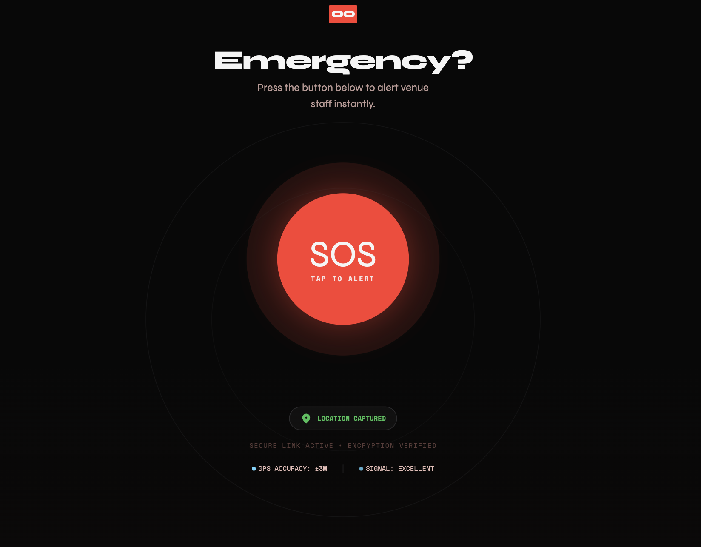
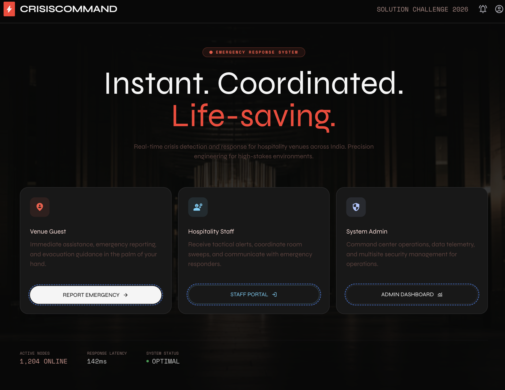
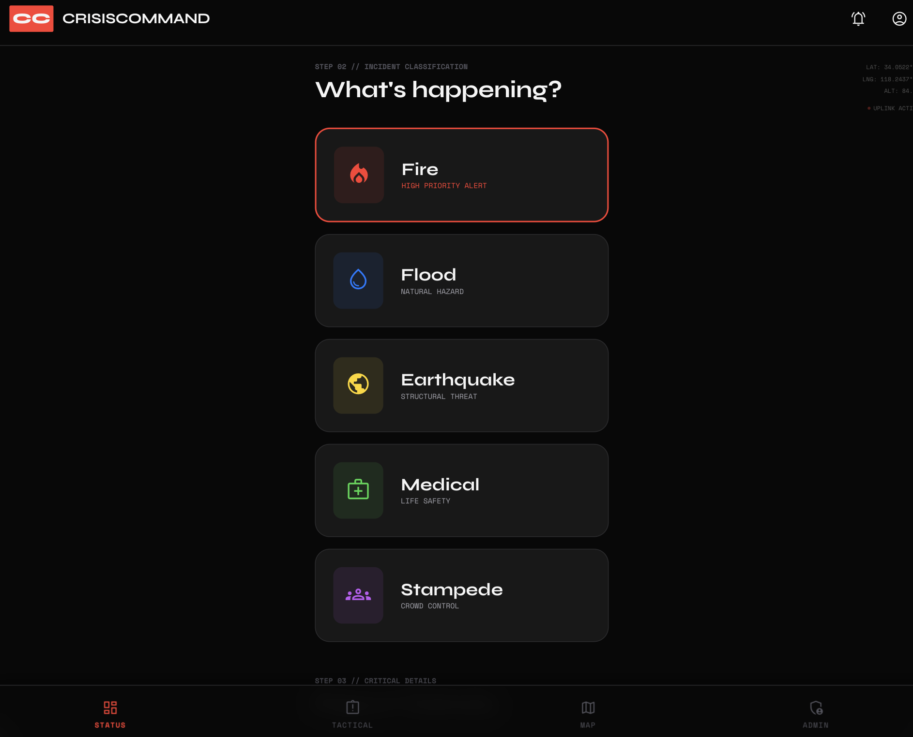
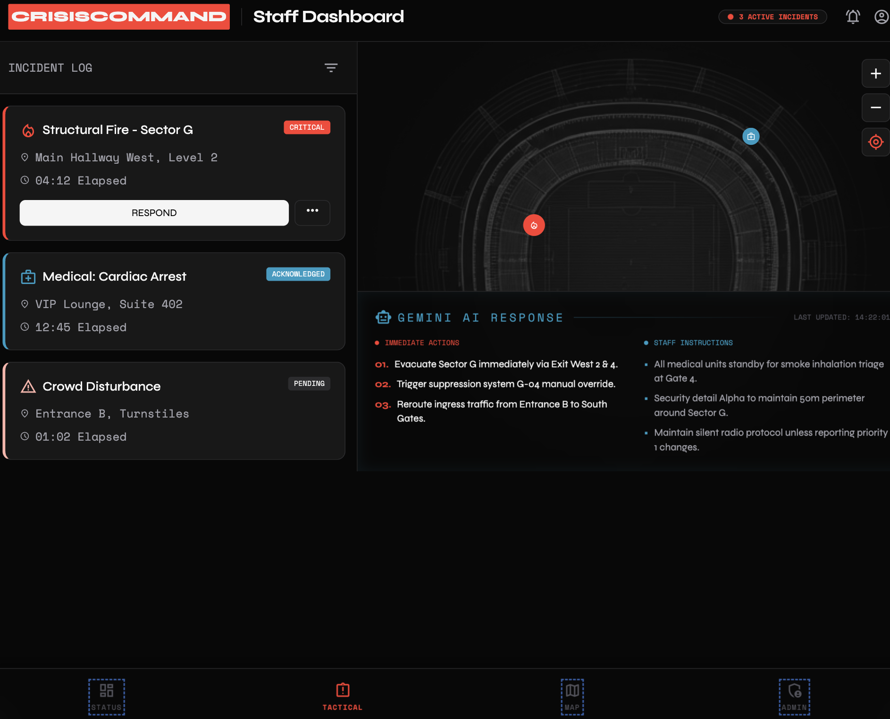
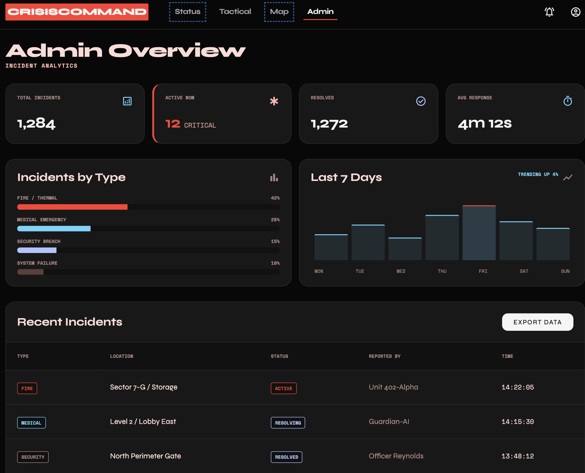
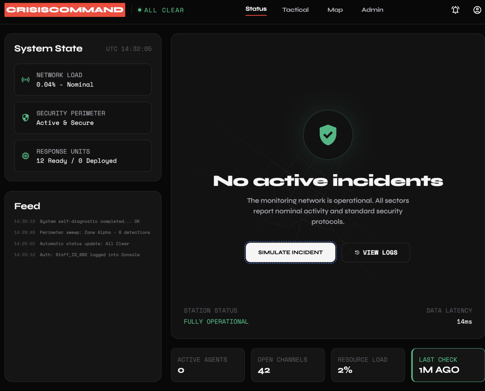
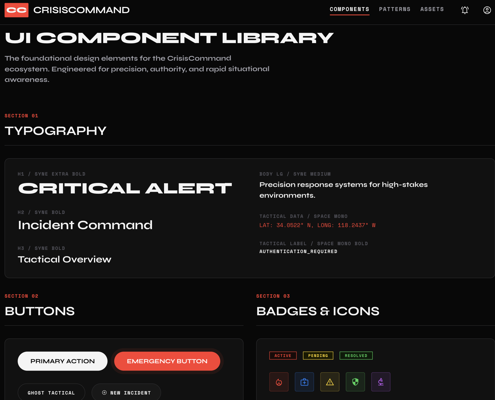
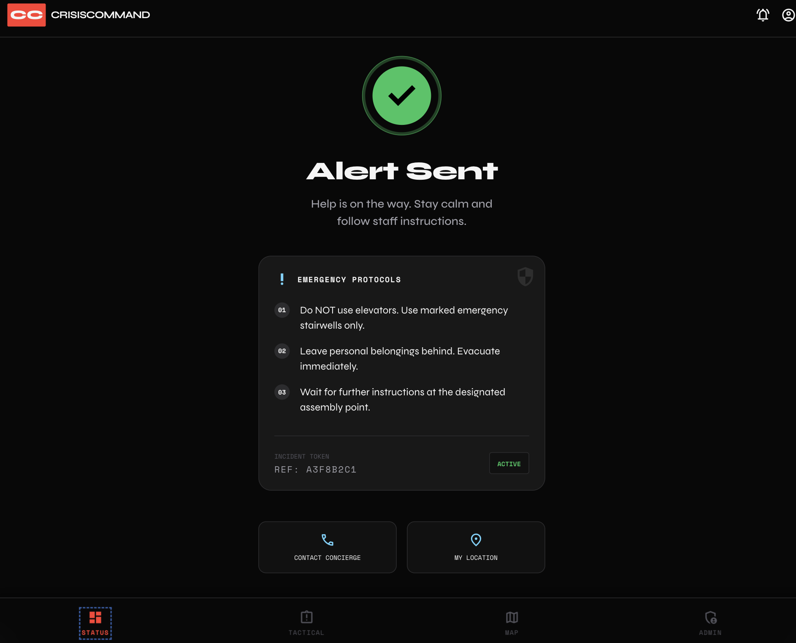

<div align="center">
  # 🚨 CrisisCommand
  **Instant. Coordinated. Life-saving.**
  
  *A real-time crisis detection, reporting, and coordination platform for hospitality venues (hotels, malls, banquet halls, event spaces).*

  [](https://nextjs.org/)
  [](https://www.typescriptlang.org/)
  [](https://firebase.google.com/)
  [](https://ai.google.dev/)
  [](https://developers.google.com/maps)
</div>

<br />

> **Submission for Google Solution Challenge 2026**

### 🎥 Demo Video
[Watch the CrisisCommand Demo](https://drive.google.com/file/d/1tYFsaUpCWO2lbBDB9cGcoFdG3qzdHWug/view?usp=drive_link)

---

## 📑 Table of Contents

1. [Inspiration & Problem Statement](#-inspiration--problem-statement)
2. [The Solution: What it Does](#-the-solution-what-it-does)
3. [Impact & UN SDGs](#-impact--un-sdgs)
4. [Target Audience & Key Features](#-target-audience--key-features)
5. [Tech Stack](#-tech-stack--google-technologies)
6. [Architecture & Workflow](#-architecture--workflow)
7. [Installation & Setup](#-installation--setup)
8. [Demo Flow (For Judges)](#-demo-flow-for-judges)
9. [Screenshots](#-screenshots)
10. [Future Roadmap](#-future-roadmap)

---

## 💡 Inspiration & Problem Statement

In large hospitality venues like hotels, malls, and banquet halls, seconds matter during an emergency. Traditional response protocols often suffer from:
- **Delayed Reporting:** Guests struggle to find who to call or where to report an incident.
- **Location Confusion:** Even when reported, pinpointing the exact location (e.g., "Hallway B, 3rd Floor") takes critical time.
- **Uncoordinated Staff Response:** Staff rely on walkie-talkies or scattered communication, leading to duplicated efforts or missed areas.
- **Lack of Protocol Knowledge:** During panic, staff and guests may forget standard operating procedures.

We needed a system with **zero human delay** that connects the person in danger directly to the response team while instantly providing AI-driven, protocol-specific instructions.

---

## 🚀 The Solution: What it Does

**CrisisCommand** is a mobile-first Progressive Web Application (PWA) designed to instantly bridge the gap between guests, venue staff, and administrators during emergencies. 

- **For Guests:** A frictionless, anonymous panic button that auto-captures their location and alerts all staff within seconds.
- **For Staff:** A real-time dashboard plotting active incidents on a venue map, powered by AI that generates immediate, crisis-specific action plans (e.g., Fire, Flood, Medical).
- **For Admins:** A bird's-eye view of response times, incident hotspots, and overall venue safety metrics.

---

## 🌍 Impact & UN SDGs

CrisisCommand aligns directly with the United Nations Sustainable Development Goals:
- **SDG 3 (Good Health and Well-Being):** By reducing emergency response times for medical crises or stampedes, the platform actively saves lives and minimizes injuries.
- **SDG 11 (Sustainable Cities and Communities):** Enhances the resilience and safety of public spaces, ensuring that large gatherings and urban hospitality venues are secure environments for everyone.

---

## 👥 Target Audience & Key Features

### 1. 🆘 Guests (The Reporters)
- **Frictionless SOS UI:** A large, intuitive panic button. No login or app download required.
- **Location Auto-Capture:** Silently pinpoints exact geolocation and optionally captures room/floor details.
- **5 Supported Crisis Types:** Fire 🔥, Flood 🌊, Earthquake 🌍, Medical 🏥, Stampede 🚨.
- **Reassurance Timer:** Displays an AI-estimated response time to keep the guest calm.

### 2. 🛡️ Staff (The Responders)
- **Real-Time Alert Feed:** Incidents appear with zero human delay (< 2 seconds via Firebase Realtime Database).
- **Venue Map Integration:** Google Maps plots active incidents with color-coded pins based on severity and crisis type.
- **AI-Generated Action Plans:** Google Gemini 1.5 Flash instantly generates specific response protocols (e.g., "Cut off gas lines", "Evacuate Zone B") tailored to the crisis type and Indian emergency protocols.
- **One-Click Acknowledgement:** Staff can instantly claim an incident, letting others know help is on the way.

### 3. 📊 Admin (The Managers)
- **Analytics Dashboard:** Visualizes total incidents, average response times, and active crises using Recharts.
- **Post-Incident Analysis:** Helps identify high-risk zones and evaluate staff performance.

---

## 🛠️ Tech Stack & Google Technologies

We leveraged Google's powerful ecosystem to build a fast, scalable, and intelligent platform.

### 🌟 Google Technologies
- **Google Gemini API (1.5 Flash):** Acts as our "AI Emergency Coordinator." When an incident is reported, Gemini instantly generates specific `immediateActions`, `staffInstructions`, and `guestInstructions`.
- **Firebase Firestore:** NoSQL cloud database for storing incident reports and staff data.
- **Firebase Realtime Database:** Powers the ultra-low latency (< 2s) alert feed for staff.
- **Firebase Authentication:** Secures staff and admin dashboards (Anonymous auth for guests).
- **Google Maps JavaScript API:** Provides the interactive venue map and spatial awareness for staff to pinpoint emergencies.

### 💻 Frontend & Core
- **Next.js 14 (App Router):** Fast, React-based framework for server-side rendering and API routes.
- **TypeScript:** Ensures strict type safety across the entire codebase.
- **Tailwind CSS:** For rapid, responsive, and accessible UI styling.
- **Zustand:** Lightweight global state management.

---

## 🏗️ Architecture & Workflow

1. **Trigger:** Guest presses SOS button and selects crisis type.
2. **Capture:** Browser Geolocation API captures coordinates.
3. **Write:** Next.js client writes incident to Firestore.
4. **Broadcast:** Firebase Realtime Database pushes update to all active Staff dashboards instantly.
5. **Analyze:** Next.js API route triggers Google Gemini API with incident details.
6. **Enrich:** Gemini returns structured JSON protocols, updating the Firestore document.
7. **Action:** Staff acknowledges the incident on the dashboard, updates status, and follows AI instructions.

---

## ⚙️ Installation & Setup

Follow these steps to run the project locally.

### Prerequisites
- Node.js 18+
- npm or yarn or pnpm
- A Firebase Project
- A Google Cloud Project (with Gemini & Maps APIs enabled)

### 1. Clone the repository
```bash
git clone https://github.com/yourusername/crisis-command.git
cd crisis-command
```

### 2. Install dependencies
```bash
npm install
```

### 3. Environment Variables
Create a `.env.local` file in the root directory and add the following keys:
```env
# Firebase Configuration
NEXT_PUBLIC_FIREBASE_API_KEY=your_api_key
NEXT_PUBLIC_FIREBASE_AUTH_DOMAIN=your_project_id.firebaseapp.com
NEXT_PUBLIC_FIREBASE_PROJECT_ID=your_project_id
NEXT_PUBLIC_FIREBASE_STORAGE_BUCKET=your_project_id.appspot.com
NEXT_PUBLIC_FIREBASE_MESSAGING_SENDER_ID=your_sender_id
NEXT_PUBLIC_FIREBASE_APP_ID=your_app_id
NEXT_PUBLIC_FIREBASE_DATABASE_URL=https://your_project_id.firebaseio.com

# Google APIs
NEXT_PUBLIC_GEMINI_API_KEY=your_gemini_api_key
NEXT_PUBLIC_GOOGLE_MAPS_API_KEY=your_google_maps_api_key

# Staff/Admin Authentication
NEXT_PUBLIC_STAFF_PIN=1234
```

### 4. Run the development server
```bash
npm run dev
```
Open [http://localhost:3000](http://localhost:3000) with your browser to see the result.

*(Optional)* To populate the database with demo data:
```bash
npx ts-node scripts/seed.ts
```

---

## 🎬 Demo Flow (For Judges)

To evaluate the core functionality of CrisisCommand:

1. **Role Selection:** Navigate to `/` to see the Role Selection screen.
2. **Guest View (Mobile Simulation):**
   - Click "Guest" (ideally view in mobile responsive mode).
   - Press the pulsing **SOS** button.
   - Select **Fire**. The app will capture your location and submit the report.
3. **Staff Dashboard (Real-time Sync):**
   - In a separate tab, open `/` and select **Staff** (PIN: 1234).
   - Observe the new Fire incident appear in the feed in under 2 seconds.
   - Click on the incident to view the map pin.
4. **AI Generation:**
   - Watch the **AI Response Panel** populate with specific instructions generated by Gemini 1.5 Flash.
5. **Action:**
   - Click **Acknowledge** and see the status change across the network.
6. **Admin View:**
   - Open `/admin` to view live charts (Recharts) aggregating incident data.

---

## 📸 Screenshots

Here is a visual overview of the CrisisCommand platform:

### Landing Page


### Guest SOS Flow



### Staff Dashboard




### Admin Analytics



---

## 🔮 Future Roadmap

- **IoT Integration:** Connecting physical smoke detectors and panic buttons directly to the platform.
- **Offline-First Capabilities:** Enhancing PWA features so incidents can queue via Bluetooth mesh networks if internet fails (crucial for earthquakes).
- **Multilingual Support:** Auto-translating AI instructions into the guest's native language.
- **Predictive Analytics:** Using historical data to predict structural vulnerabilities or medical emergency hotspots.

---

<div align="center">
  <i>Built with ❤️ for Google Solution Challenge 2026</i>
</div>
